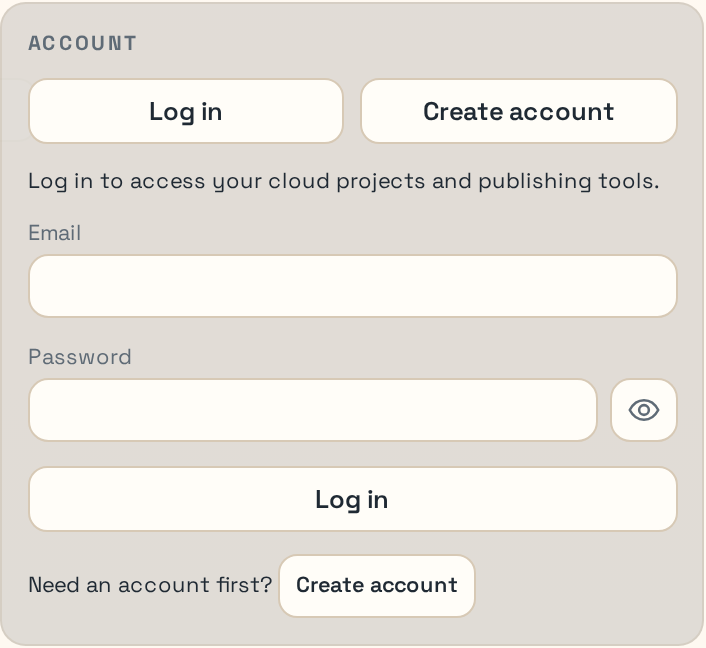
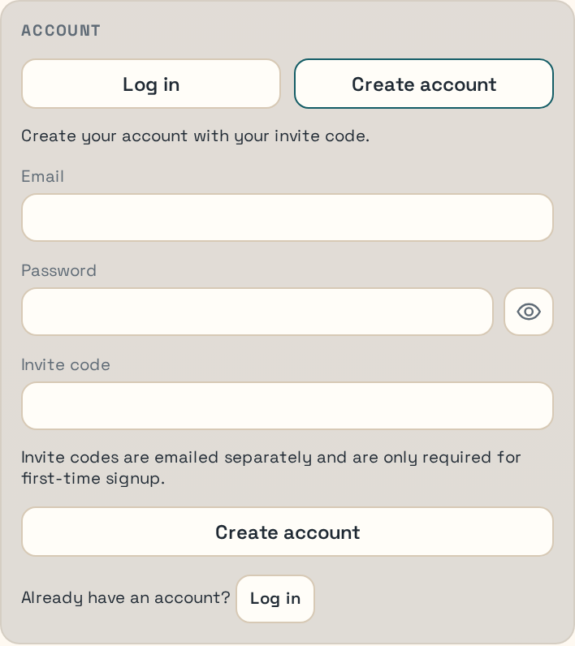
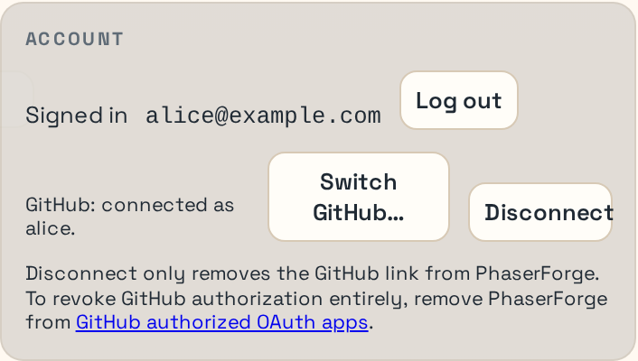

# Cloud Account Setup

This is the first workflow a new PhaserForge user should complete. The normal path is cloud-first:

1. create your PhaserForge account with an email invite code, or log in if you already have one
2. confirm you are signed in
3. connect the GitHub account you want PhaserForge to publish through

## What You Need Before You Start

- a running PhaserForge session
- your email address
- an invite code if you are creating your account for the first time
- the GitHub account you intend to use for publishing

## 1. Open the Cloud Pane

Open the `Cloud` tab in the right-side pane. If PhaserForge has not signed you in yet, `Cloud` may already be the visible default tab when the editor opens.

<em>Figure 1. Cloud pane before sign-in.</em>

Success check:
- You can see the account section and the publish section.

## 2a. Create Your Account with the Invite Code

If you do not already have a PhaserForge account:

1. choose `Create account`
2. enter your email
3. enter your password
4. enter the invite code
5. submit the form

<em>Figure 2. Cloud account create-account form.</em>

Success check:
- The account flow accepts your signup and you land in a signed-in state.

## 2b. Log In

If you already have a PhaserForge account, use the default `Log in` tab instead:

1. choose `Log in`
2. enter your email
3. enter your password
4. submit the form

Success check:
- The Cloud pane shows you as signed in.

## 3. Connect GitHub

After you are signed in, connect the GitHub account you want PhaserForge to use for publishing.

If you do not already have a GitHub personal account:

1. open GitHub's official account-creation guide: [Creating an account on GitHub](https://docs.github.com/en/get-started/start-your-journey/creating-an-account-on-github)
2. complete the GitHub signup flow and verify your email address
3. return to PhaserForge and continue with the connection steps below

Use the Cloud pane action for:

- `Connect GitHub` if no GitHub account is linked yet
- `Switch GitHub…` if the wrong GitHub account is currently linked

Continue through the GitHub authorization flow in the browser. Figure 3 shows the signed-in, GitHub-linked state you want before moving on to project work.

<em>Figure 3. Cloud account signed-in and GitHub-linked state.</em>

Success check:
- The Cloud pane reports that GitHub is connected.
- The publish section no longer asks you to connect GitHub first.

## 4. Confirm You Are Ready for the Normal Workflow

Before you move on, make sure all three conditions are true:

- you are signed in to PhaserForge
- GitHub is connected
- the Cloud pane publish section is available

At that point, you are on the intended first-user path.

## What to Do Next

Continue to [Build the Pattern Demo](./pattern-demo).
