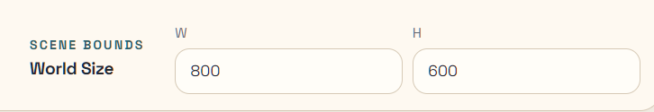
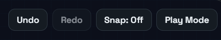

# Pattern Demo

This walkthrough recreates the `Pattern Demo` scene in PhaserForge. It assumes you already completed [Cloud Account Setup](./cloud-account-setup) and are continuing in the normal signed-in path. 

## What You Will Build

- seven ship sprites arranged in two rows
- a text label above each ship
- one movement pattern attached to each ship
- background music
- a project that is ready for the GitHub Pages publish workflow in the next guide

## Before You Start

- Open PhaserForge and sign in if needed.
- If you are continuing from older work, reset to a new empty scene from the Project Tree in the upper left. Click `Manage -> Create New`.
- Stay in the same signed-in project flow you established during cloud account setup.
- Set the scene world size to `800 x 600` and then the `Fit` button to recenter the canvas to full size before you begin placing ships.

<em>Figure 1. World Size dimensions (in pixels).</em>

Success check:
- The canvas is empty and the scene graph does not show leftover sprites or formations.
- The World Size is `800 x 600`, as shown in the Viewport panel (Figure 1), and the viewport is fully fit to the canvas. 

## Import the Demo Pack Assets 

1. Using the Assets Dock at the bottom of the left sidebar, click "+ Add".

   - **NOTE:** A popup menu will appear.

<em>Figure 2. Assets Dock add menu showing the Demo Pack import option.</em>

2. In the popup menu, select "From demo pack".

   - **NOTE:** A list of sprites with thumbnails will appear in the Assets Dock. 

<em>Figure 3. Assets Dock after importing the Demo Pack assets.</em>

## Create the Sprites

1. In the Assets Dock under Images, scroll down to find the image labeled "ship_sidesA". 

2. Drag the ship_sidesA image from the Dock onto the center canvas to create a spaceship object (or "sprite") there.

   - **NOTE:** If everything goes correctly, you will see the ship (titled "entity") also show up in the Sprites list in the left sidebar. The imported ship will look a bit too large on the canvas; this is normal.

3. Hold down the Alt key and drag a copy of the spaceship sprite to a new location until you have seven ships total. 

4. Rename each of the seven ships you duplicated, starting with the ship titled `entity` in the Sprites list (in the left sidebar).
   
   a. Click the ship name to highlight it
   
   b. Hit the `F2` key (Rename)
   
   c. Delete the old entity title

   d. Type `Wave` followed by the `ENTER` key

5. Move to the next sprite name in the list (`entity2`) by hitting the `Down Arrow` on your keyboard, then follow the same procedure above to rename it.

   - top row: `Wave`, `Zigzag`, `Figure-8`, `Orbit`
   - bottom row: `Spiral`, `Bounce`, `Patrol`

6. Continue until you have renamed all seven sprites to the names above, so the later pattern steps are easier to follow.

<em>Figure 4. Scene graph Sprites list after renaming all seven ships.</em>

Success check:
- You can see seven separate sprite entities in the scene graph.
- Their names match the list above.

## Position the Ships with Selection Tools and Layout

1. Rough-place the ships first, then use `Layout…` to clean up spacing. The pattern demo uses two rows:

   - top row: `Wave`, `Zigzag`, `Figure-8`, `Orbit`
   - bottom row: `Spiral`, `Bounce`, `Patrol`

<em>Figure 5. On-canvas selection bar for multi-selection actions.</em>

<em>Figure 6. Layout popover for spacing and set-position operations.</em>

2. For the top row, drag-select (or SHIFT-click to select) the four ships and use `Layout…` to:

   - Under Spacing, type `180` in the `Spacing X` box, then hit `Apply Spacing X`.
   - Under Position Selection, type `200` in the `Y` box, then hit `Set Y`.
   - Finally, under Align Selection, hit `Center X`.

3. For the bottom row, drag-select (or SHIFT-click to select) all three ships and use `Layout …` again. Set `Spacing X` to `180`, **`Y` to `420`**, then center the ships with `Center X` as above.

<em>Figure 7. Ships lined up - success check.</em>

Success check:
- The four top-row ships are equally spaced and centered, and sit on same `Y = 200` baseline.
- The three bottom-row ships are equally spaced and centered, and sit on same `Y = 420` baseline.

## Add the Text Labels

1. In the left sidebar, under Scene Graph, click the "+ Add" button beside Text. 

   - **NOTE:** This will create one text entity called 't'. 

2. Hit the F2 key and rename the text entity to "Wave"

3. Rough-place the text entity (i.e., drag it) over top of the Wave sprite (the leftmost of the top row of sprites).

4. Hit the F3 key and type in "Wave" as the text property of the highlighted entity. 

   - **NOTE:** you should see the text change for the entity in the Canvas.

5. Repeat these steps for each of the sprites in the top and bottom rows until you have named labels over each of the ship sprites.

   - top row: `Wave`, `Zigzag`, `Figure-8`, `Orbit`
   - bottom row: `Spiral`, `Bounce`, `Patrol`
   - **NOTE:** You may be tempted to use Alt-Drag to duplicate the text entities as you did earlier with the ship sprites, but duplicating the text entities also copies their name and text as well, so this can quickly get confusing. Using "+ Add" is the better approach in this scenario.

6. Drag-to-select (or SHIFT-click to select each of) the top-row labels, and in the popup Selection Bar, use `Layout …`:

   - Under Arrange Items, click `Distribute X`.
   - Under Position Selection, type `120` under `Y`, then click `Set Y`. 
   - Under Align Selection, click `Center X`.
   - Click the "Close" button at the bottom of the Layout popup, or just click in a blank area of the canvas to close it.

7. Click a blank space somewhere in the canvas to deselect the top-row sprites.

8. Drag-to-select (or SHIFT-click to select each of) the bottom-row labels, and in the popup Selection Bar, use `Layout …`. 

   - Under Arrange Items, click `Distribute X`.
   - Under Position Selection, type `340` under `Y`, then click `Set Y`. 
   - Under Align Selection, click `Center X`.
   - Click the "Close" button at the bottom of the Layout popup, or just click in a blank area of the canvas to close it.

<em>Figure 8. Ships and titles lined up - success check.</em>

Success check:
- Each ship has one readable label above it.
- Labels are visually aligned with the ships.

## Attach the Movement Patterns

**NOTE:** The goal is to build the patterns one ship at a time in the same scene-start event flow. Take your time, and work ship-by-ship. Your progress is saved automatically, so you can return to the process later.

**NOTE:** Hit `Play Mode` in the upper-right of the canvas to check each ship's actions as you build them. After you've viewed the action steps, click the same button again to return to `Edit Mode`.

<em>Figure 9. Actions/Events panel for authoring scene-start handlers and action steps.</em>

### Wave action

1. Select the ship titled `Wave` on the canvas or in the scene graph.
2. On the Inspector tab in the right sidebar, open the `Actions/Events` panel.

   **NOTE:** If other open panels are cluttering the Inspector, you can close them with the chevron next to each panel name.
3. Click `+ Add Action` in the panel's `OnSceneStart` handler.

   **NOTE:** The Action Library popup will appear.
4. In the Action Library categories, click the `Loops` tab.
5. Under Actions, choose `Intro then Repeat…`

   **NOTE:** The Action Library popup will close, and OnSceneStart will contain three actions: Intro, Repeat, and a nested Loop body.
6. Click on the Intro action name in the Steps list. 

   **NOTE:** The Inspector will switch to show `Intro` step properties.
7. Set the Intro step properties to the following:
   - `Type = Wave`
   - `startProgress = 0.75`
   - The other defaults are fine.
8. Click the Back arrow in the properties panel to return to the Actions list.
9. Click on the `Loop Body` name in the Steps list.

   **NOTE:** The Inspector will switch to show `Loop Body` step properties.
10. Set the `Loop Body` step properties to the following:
   - `Type = Wave`
   - The other defaults are fine.
11. Click the Back arrow in the properties panel to return to the Actions list.

<em>Figure 10. Wave pattern inspector with intro-step progress parameters.</em>

### Zigzag action

1. Select the ship titled `Zigzag` on the canvas or in the scene graph.

   **NOTE:** Remember to collapse other panels besides `Actions/Events` in the Inspector if it is too cluttered.
2. Click `+ Add Action` in the panel's `OnSceneStart` handler under the `Actions/Events` panel.

   **NOTE:** The Action Library popup will appear.
3. In the Action Library categories, click the `Loops` tab.
4. Under Actions, choose `Repeat With Children…`
5. Leave `Children = 2`, set `Child Type = Zigzag Pattern` and click the `Create` button.

   **NOTE:** The Inspector will switch to show the `Repeat` action properties.
6. Set the Loop properties to the following:
   - `Name = Loop`
   - Make sure the `Count` property stays empty, so it repeats forever.
   - The other defaults are fine.
   - Click the Back arrow in the properties panel to return to the Actions list.
7. Click on the second `Zigzag Pattern` in the Steps list.

   **NOTE:** The Inspector will switch to show `Zigzag` step properties.
8. Set the second `Zigzag` step properties to the following:
   - `Width = -30`
   - `Height = -15`
   - The other defaults are fine.
   - Click the Back arrow in the properties panel to return to the Actions list.
9. Click the `...` next to the Loop in the Actions list. 

    **NOTE:** A popup menu will appear below. 
10. Click `+ Add Action Above` in the popup menu.

    **NOTE:** The Action Library will popup above the Loop action.
11. Click `Move By` in the Action library to add it to the Actions list. 
12. Click the `Move By` action in the Actions list to set its properties: 
    - `Name = Offset`
    - `Δx = -15`
    - `Δy = -30`

### Figure-8 action

1. Select the ship titled `Figure-8` on the canvas.
2. Click `+ Add Action` in the panel's `OnSceneStart` handler under the `Actions/Events` panel.

   **NOTE:** The Action Library popup will appear.
3. In the Action Library categories, click the `Loops` tab.
4. In the Actions list, click `Repeat with Children…`

   **NOTE:** The Actions Library will close, and a popup menu in the `OnSceneStart` menu will appear.
5. Set `Children = 1` and `Child Type = Figure-8 Pattern` in the popup menu, then click the `Create` button.
6. Set the `Repeat` step properties in the Inspector to the following:
   - `Name = Loop`
   - The other defaults are fine.
   - Click the Back arrow in the properties panel to return to the Actions list.

### Orbit action

1. Select the ship titled `Orbit` on the canvas.
2. In the Inspector, expand the Transform panel (if it's not already visible) by clicking the chevron next to its name.
3. Check the box labeled `Flip Y`.
4. Click the Transform panel chevron again to close it.
5. Click `+ Add Action` in the panel's `OnSceneStart` handler under the `Actions/Events` panel.

   **NOTE:** The Action Library popup will appear.
6. In the Action Library categories, click the `Loops` tab.
7. In the Actions list, click `Repeat with Children…`

   **NOTE:** The Actions Library will close, and a popup menu in the `OnSceneStart` menu will appear.
8. Set `Children = 1` and `Child Type = Orbit Pattern` in the popup menu, then click the `Create` button.
9. Click the Back arrow in the properties panel to return to the Actions list.

### Spiral action

1. Select the ship titled `Spiral` on the canvas.
2. Click `+ Add Action` in the panel's `OnSceneStart` handler under the `Actions/Events` panel.

   **NOTE:** The Action Library popup will appear.
3. In the Action Library categories, click the `Loops` tab.
4. In the Actions list, click `Repeat with Children…`

   **NOTE:** The Actions Library will close, and a popup menu in the `OnSceneStart` menu will appear.
5. Set `Child Type = Spiral Pattern` in the popup menu, then click the `Create` button.
6. Click the Back arrow in the properties panel to return to the Actions list.
7. Click on `Child 2` in the Actions list.
8. Set the `Child 2` properties to:
    - `Direction = Inward`
    - `Flip Y = Checked`
    - The other defaults are fine.
    - Click the Back arrow in the properties panel to return to the Actions list.

### Bounce action

1. Select the ship titled `Bounce` on the canvas.
2. Click `+ Add Action` in the panel's `OnSceneStart` handler under the `Actions/Events` panel.

   **NOTE:** The Action Library popup will appear.
3. In the Action Library categories, click the `Movement` tab.
4. Add a `Bounce` step and set:
   - `Name = BounceBox`
   - `Velocity X = 100`
   - In the `Bounds` panel for the same ship:
      - Switch `Bounds` edit mode to `Center/Span`
      - Set `± X Span = 50`
      - Set `± Y Span = 60`
      - Click the Back arrow in the properties panel to return to the Actions list.

<em>Figure 11. Bounce pattern with the bounds helper in Center/Span mode.</em>

### Patrol action

1. Select the ship titled `Patrol` on the canvas.
2. Click `+ Add Action` in the panel's `OnSceneStart` handler under the `Actions/Events` panel.

   **NOTE:** The Action Library popup will appear.
3. In the Action Library categories, click the `Movement` tab.
4. Add a `Patrol` step and set:
   - `Velocity X = 80`
   - In the `Bounds` panel for the same ship:
      - Switch `Bounds` edit mode to `Center/Span`
      - Set `± X Span = 40`
      - Switch `Bounds` edit mode to `Min/Max`
      - Set `Min Y = 400`
      - Set `Max Y = 500`

<em>Figure 12. Patrol pattern with the final bounds values visible in Min/Max mode.</em>

Success check:
- Every ship shows a handler/action flow in the editor.
- `Bounce` and `Patrol` have their bounds configured, not just the pattern action itself.

## Add Music to the Demo

1. Click on a blank part of the Canvas.
   
   **NOTE:** The Inspector for the canvas itself will appear in the right sidebar.

2. In the Inspector, expand the Audio panel (if it's not already visible) by clicking the chevron next to its name.
3. Click on the Music dropdown box and select a song from the Demo Pack, like "sb-indreams-chosic-com" or whichever one you like.
4. Adjust the Volume setting if you like.

## Run the Demo in Play Mode

Toggle into Play mode with `Tab` or the toolbar button, and let the scene run long enough to verify all seven motions.

<em>Figure 13. Toolbar region with Play/Edit toggle and status controls.</em>

Look for these outcomes:

- all seven ships animate simultaneously
- labels remain static
- no ship leaves the scene unexpectedly
- `Bounce` and `Patrol` stay inside their intended travel areas

If a ship is motionless, go back to its handler and confirm the action flow exists and that the pattern settings were applied to the correct ship.

Success check:
- The scene behaves like a motion sampler rather than a static layout.

## What to Do Next

Continue to [Publish to GitHub Pages](./publish-to-github-pages) to turn the saved demo into a hosted playable page.
