# Pattern Demo

This walkthrough recreates the `Pattern Demo` scene in PhaserForge. It assumes you already completed [Cloud Account Setup](./cloud-account-setup) and are continuing in the normal signed-in path. 

## What You Will Build

- seven ship sprites arranged in two rows
- a text label above each ship
- one movement pattern attached to each ship
- background music
- a project that is ready for the GitHub Pages publish workflow in the next guide

## Before You Start

- Open PhaserForge and sign in if needed.
- If you are continuing from older work, reset to a new empty scene from `Project -> Startup & Reset`.
- Stay in the same signed-in project flow you established during cloud account setup.
- Set the scene world size to `800 x 600` before you begin placing ships.

Success check:
- The canvas is empty and the scene graph does not show leftover sprites or formations.

## Import the Demo Pack Assets 

1. Using the Assets Dock at the bottom of the left sidebar, click "+ Add".

- **NOTE:** A popup menu will appear.

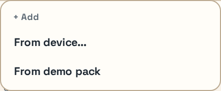

<em>Figure 4. Assets Dock add menu showing the Demo Pack import option.</em>

2. In the popup menu, select "From demo pack".

- **NOTE:** A list of sprites with thumbnails will appear in the Assets Dock. 

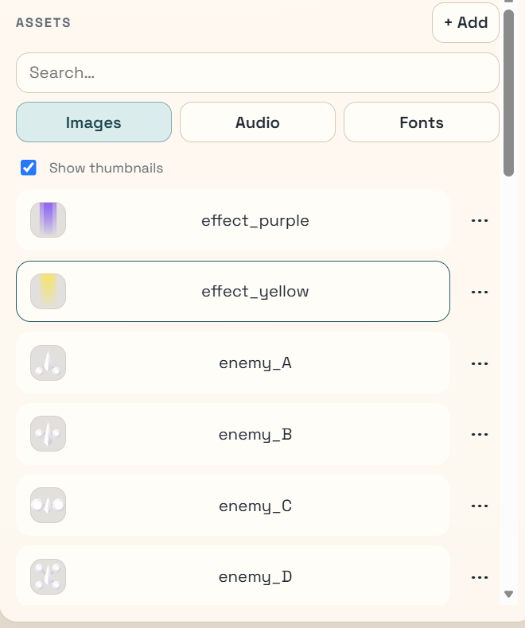

<em>Figure 5. Assets Dock after importing the Demo Pack assets.</em>

## Create the Sprites

1. In the Assets Dock under Images, scroll down to find the image labeled "ship_sidesA". 

2. Drag the ship_sidesA image from the Dock onto the center canvas to create a spaceship object (or "sprite") there.

- **NOTE:** If everything goes correctly, you will see the ship (titled "entity") also show up in the Sprites list in the left sidebar. The imported ship will look a bit too large on the canvas; this is normal.

3. Click on the ship to select it, then reduce its `Scale X (%)` to `50` in the Inspector (in the right sidebar). 

- **NOTE:** Changing `Scale X (%)` to `50` will automatically change `Scale Y (%)` to `50` as well; the aspect ratio is locked together with the highlighted link button.

4. Hold down the Alt key and drag a copy of the spaceship sprite to a new location until you have seven ships total. 

5. Rename each of the seven ships you duplicated, starting with the ship titled `entity` in the Sprites list (in the left sidebar).
   a. Click the ship name to highlight it
   b. Hit the `F2` key (Rename)
   c. Delete the old entity title
   d. Type `Wave` followed by the `ENTER` key
   e. Move to the next sprite name in the list by hitting the `Down Arrow` on your keyboard
   f. then follow the same procedure above to rename it.

Name the seven ships you duplicated:

1. `Wave`
2. `Zigzag`
3. `Figure-8`
4. `Orbit`
5. `Spiral`
6. `Bounce`
7. `Patrol`

Move to the next sprite name in the list (`entity2`) by hitting the `Down Arrow` on your keyboard, then follow the same procedure above to rename it.

Continue until you have renamed all seven sprites to the names above, so the later pattern steps are easier to follow.

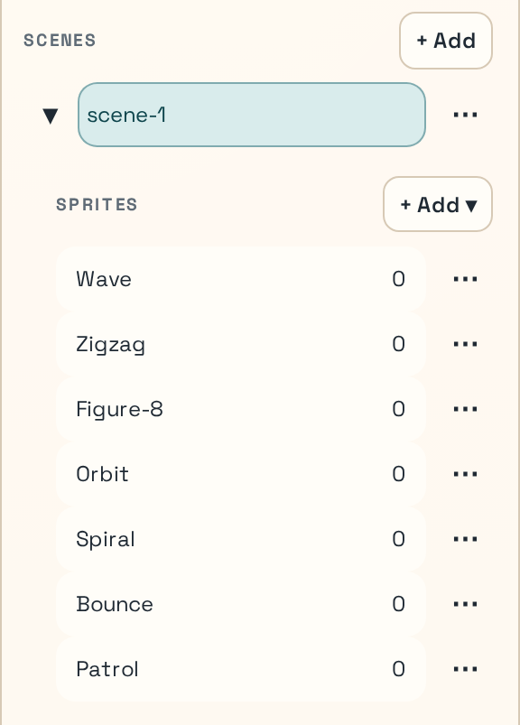

<em>Figure 6. Scene graph Sprites list after renaming all seven ships.</em>

Success check:
- You can see seven separate sprite entities in the scene graph.
- Their names match the list above.

## Position the Ships with Selection Tools and Layout

Rough-place the ships first, then use `Layout…` to clean up spacing. The pattern demo uses two rows:

- top row: `Wave`, `Zigzag`, `Figure-8`, `Orbit`
- bottom row: `Spiral`, `Bounce`, `Patrol`

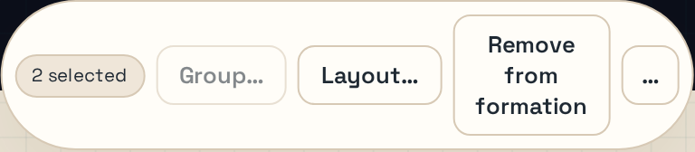

<em>Figure 7. On-canvas selection bar for multi-selection actions.</em>

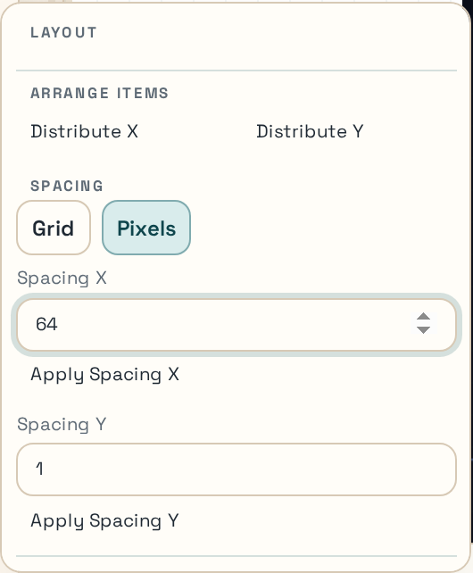

<em>Figure 8. Layout popover for spacing and set-position operations.</em>

For the top row, drag-select (or SHIFT-click to select) the four ships and use `Layout…` to:

- Under Spacing, type `180` in the `Spacing X` box, then hit `Apply Spacing X`.
- Under Position Selection, type `200` in the `Y` box, then hit `Set Y`.
- Finally, under Align Selection, hit `Center X`.

For the bottom row, drag-select (or SHIFT-click to select) all three ships and use `Layout …` again. Set `Spacing X` to `180`, **`Y` to `420`**, then center the ships with `Center X` as above.

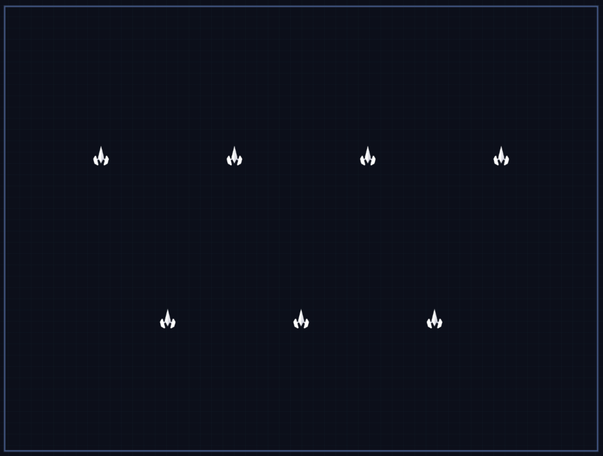

<em>Figure 9. Ships lined up - success check.</em>

Success check:
- The four top-row ships are equally spaced and centered, and sit on same `Y = 200` baseline.
- The three bottom-row ships are equally spaced and centered, and sit on same `Y = 420` baseline.

## Add the Text Labels

In the left sidebar, under Scene Graph, click the "+ Add" button beside Text. 

**NOTE:** This will create one text entity called 't'. 

Hit the F2 key and rename the text entity to "Wave", then rough-place it (i.e., drag it) over top of the Wave sprite (the leftmost of the top row of sprites).
Next, hit the F3 key and type in "Wave" as the text property of the highlighted entity. 

**NOTE:** you should see the text change for the entity in the Canvas.

Repeat these steps for each of the sprites in the top and bottom rows until you have named labels over each of the ship sprites.

**NOTE:** You may be tempted to use Alt-Drag to duplicate the text entities as you did earlier with the ship sprites, but duplicating the text entities also copies their name and text as well, so this can quickly get confusing. Using "+ Add" is the better approach in this scenario.

Lastly, drag-select (or SHIFT-click to select) the top-row labels, and in the popup Selection Bar, use `Layout …`. 

Under Arrange Items, click "Distribute X", and under Position Selection, type `120` under `Y`, then click `Set Y`. Finally, under Align Selection, click "Center X".

Click the "Close" button at the bottom of the Layout popup, or just click in a blank area of the canvas to close it.

Next, click a blank space somewhere in the canvas to deselect the top-row sprites.

Now drag-select (or SHIFT-click to select) the bottom-row labels, and in the popup Selection Bar, use `Layout …`. 

Under Arrange Items, click "Distribute X", and under Position Selection, type `340` under `Y`, then click `Set Y`. Finally, under Align Selection, click "Center X".

Click the "Close" button at the bottom of the Layout popup, or just click in a blank area of the canvas to close it.

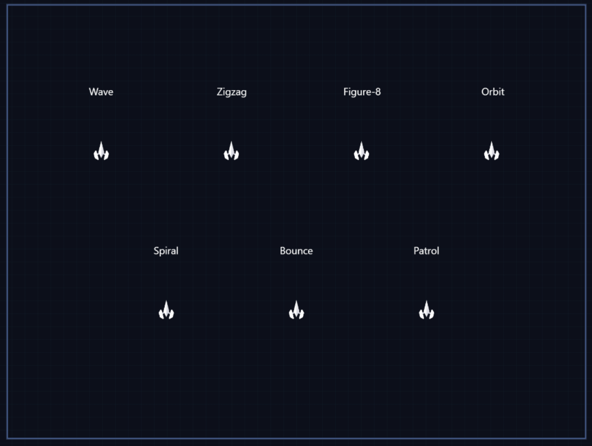

<em>Figure 10. Ships and titles lined up - success check.</em>

Success check:
- Each ship has one readable label above it.
- Labels are visually aligned with the ships.

## Attach the Movement Patterns

Select each ship, open `Actions/Events`, and attach the movement pattern that matches its name. Build the patterns one ship at a time in the same scene-start event flow.

This is the slowest step of the tutorial. Work ship by ship rather than trying to author all seven flows at once.

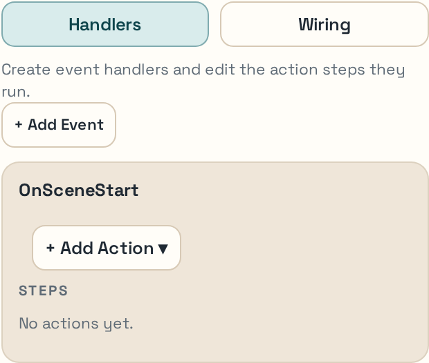

<em>Figure 11. Actions/Events panel for authoring scene-start handlers and action steps.</em>

### Common Setup for Every Ship

For each ship:

1. select the ship on the canvas or in the scene graph
2. open `Actions/Events`
3. create or open that ship's `Scene Start` handler
4. add the action steps described in the matching subsection below

### Loop Templates You Will Reuse

You will use two loop templates repeatedly in this section:

1. `Intro then Repeat…`
   Use this when the first motion pass needs different values from the repeating loop.
2. `Repeat with Children…`
   Use this when a loop should contain one or more child pattern steps.

When you use `Repeat with Children…`:

1. choose the number of children
2. choose the child type
3. leave `Count` blank if you want the pattern to repeat forever

### Wave action

Use the loop templates so you do not have to hand-build the nesting:

1. click `+ Add…`
2. choose `Loops`
3. choose `Intro then Repeat…`
4. set the intro step to `Wave`
5. set the repeat step to `Wave`

Set the intro `Wave` step to:

- `amplitude = 30`
- `length = 80`
- `velocity = 80`
- `startProgress = 0.75`
- `endProgress = 1`

Set the repeating `Wave` step to:

- `amplitude = 30`
- `length = 80`
- `velocity = 80`
- `startProgress = 0`
- `endProgress = 1`

Figure 12 shows the `Wave` pattern inspector with the progress fields that are easiest to misread when entering the intro step values.

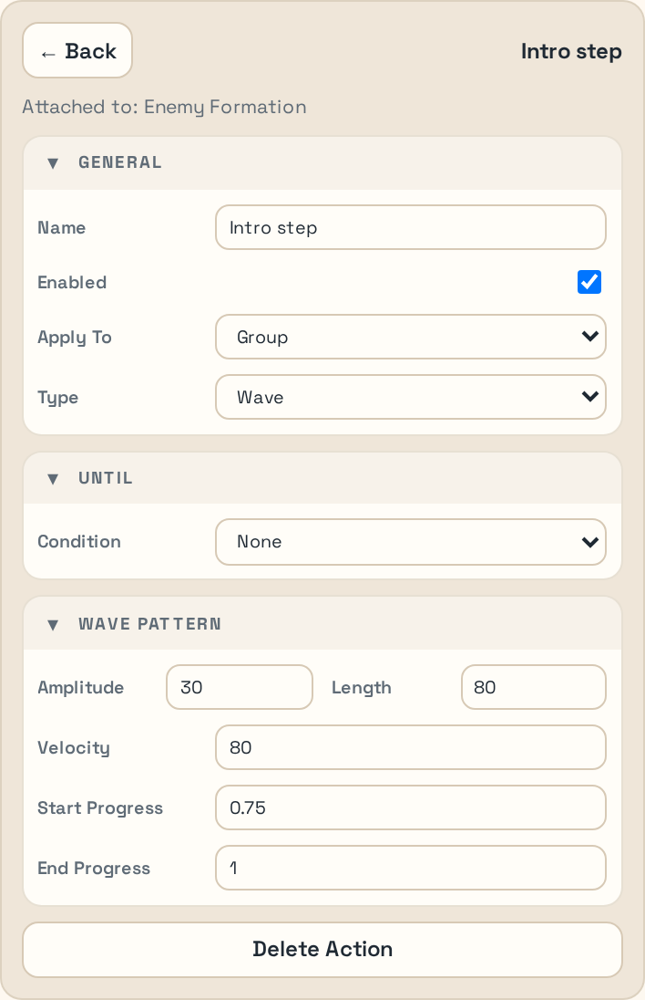

<em>Figure 12. Wave pattern inspector with intro-step progress parameters.</em>

### Zigzag action

1. click `+ Add…`
2. choose `Loops`
3. choose `Repeat with Children…`
4. set `Children = 2`
5. set `Child Type = Zigzag Pattern`
6. leave the repeat `Count` blank so it repeats forever
7. add a `Move By` step before the repeat container

Set `Move By` to:

- `dx = -15`
- `dy = -30`

Set the first `Zigzag Pattern` child to:

- `width = 30`
- `height = -15`
- `velocity = 100`
- `segments = 5`

Set the second `Zigzag Pattern` child to:

- `width = -30`
- `height = 15`
- `velocity = 100`
- `segments = 5`

### Figure-8 action

1. add `Repeat with Children…`
2. set `Children = 1`
3. choose `Figure-8 Pattern`
4. leave the repeat `Count` blank

Set the `Figure-8 Pattern` child to:

- `width = 80`
- `height = 60`
- `velocity = 100`

### Orbit action

Add a `Move To` step before the repeat so the ship starts on the orbit path.

Set `Move To` to:

- `x = 700`
- `y = 450`

Then:

1. add `Repeat with Children…`
2. set `Children = 1`
3. choose `Orbit Pattern`
4. leave the repeat `Count` blank

Set the `Orbit Pattern` child to:

- `radius = 50`
- `velocity = 100`
- `clockwise = true`
- `centerMode = home`

### Spiral action

1. add `Repeat with Children…`
2. set `Children = 2`
3. choose `Spiral Pattern`
4. leave the repeat `Count` blank

Set the first `Spiral Pattern` child to:

- `maxRadius = 60`
- `revolutions = 2`
- `velocity = 80`
- `direction = outward`

Set the second `Spiral Pattern` child to:

- `maxRadius = 60`
- `revolutions = 2`
- `velocity = 80`
- `direction = inward`

### Bounce action

Add a `Bounce Pattern` step and set:

- `axis = both`
- `velocityX = 100`
- `velocityY = 60`

Then open the separate `Bounds` panel for the same ship and configure it:

1. confirm `BoundsHit` is enabled
2. switch `Bounds` edit mode to `Center/Span`
3. use the prefilled center values for the selected ship
4. set `± X Span = 50`
5. set `± Y Span = 60`

Figure 13 shows the `Bounce` pattern and its sibling `Bounds` panel in `Center/Span` mode.

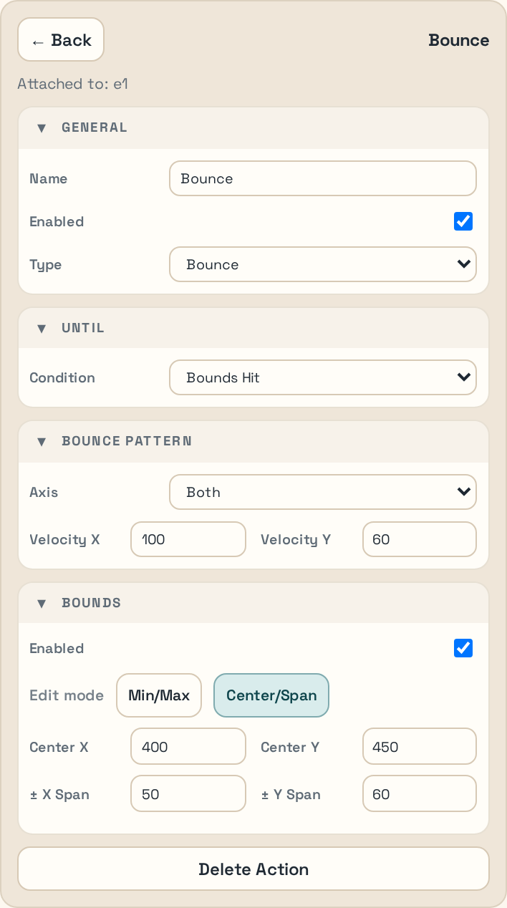

<em>Figure 13. Bounce pattern with the bounds helper in Center/Span mode.</em>

### Patrol action

Add a `Patrol Pattern` step and set:

- `axis = x`
- `velocityX = 80`

Then open the separate `Bounds` panel for the same ship and configure it:

1. confirm `BoundsHit` is enabled
2. switch `Bounds` edit mode to `Center/Span`
3. use the prefilled center values for the selected ship
4. set `± X Span = 40`
5. set `± Y Span = 0`
7. switch back to `Min/Max`
8. set `minY = 400`
9. set `maxY = 500`

Figure 14 shows the `Patrol` pattern after switching back to `Min/Max` so you can enter the final Y bounds.

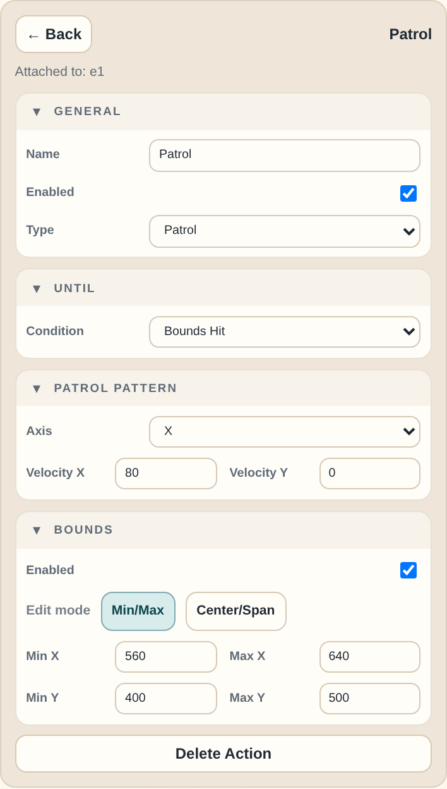

<em>Figure 14. Patrol pattern with the final bounds values visible in Min/Max mode.</em>

Practical order if you want the shortest learning path:

1. Finish `Wave`, `Figure-8`, and `Spiral` first because they are the most direct.
2. Add `Zigzag` and `Orbit` next because they need setup steps before the repeating motion.
3. Finish with `Bounce` and `Patrol` because they also need bounds configuration.

Success check:
- Every ship shows a handler/action flow in the editor.
- `Bounce` and `Patrol` have their bounds configured, not just the pattern action itself.

## Run the Demo in Play Mode

Toggle into Play mode with `Tab` or the toolbar button, and let the scene run long enough to verify all seven motions. Figure 15 shows the relevant toolbar area.

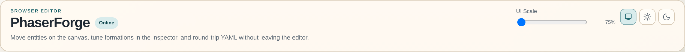

<em>Figure 15. Toolbar region with Play/Edit toggle and status controls.</em>

Look for these outcomes:

- all seven ships animate simultaneously
- labels remain static
- no ship leaves the scene unexpectedly
- `Bounce` and `Patrol` stay inside their intended travel areas

If a ship is motionless, go back to its handler and confirm the action flow exists and that the pattern settings were applied to the correct ship.

Success check:
- The scene behaves like a motion sampler rather than a static layout.

## What to Do Next

Continue to [Publish to GitHub Pages](./publish-to-github-pages) to turn the saved demo into a hosted playable page.
