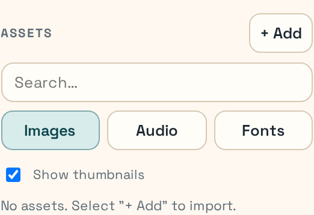
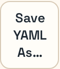

# Pattern Demo

This walkthrough recreates the `pattern_demo` scene in PhaserForge. It is the recommended first exercise because it touches the main editor loop without requiring custom code.

It is based on the current version of `.plans/pattern_demo_workflow.md`, which has been updated to match the current editor workflow inventory.

## What You Will Build

- seven ship sprites arranged in two rows
- a text label above each ship
- one movement pattern attached to each ship
- a project that is ready for the GitHub Pages publish workflow in the next guide

Figure 4. Assets Dock and scene graph in the main app shell.

## Before You Start

- Start PhaserForge locally.
- Reset to a new empty scene from `Project -> Startup & Reset` if you are continuing from old work. This matches **A59 — Configure Startup / Reset** in the workflow inventory.
- Stay on the normal signed-in cloud-first path you completed in the previous guide. Do not treat local YAML export as your main persistence workflow here.
- Keep the [Editor Workflow Reference](../reference/editor-workflows) nearby if you want the exact names for controls like `Layout…`, `Save YAML As…`, or `Toggle Edit / Play`.

Success check:
- The canvas is empty and the scene graph does not show leftover sprites or formations.

## 1. Import the Ship Asset and Create the Sprites

Use the Assets Dock on the left side to bring in one ship image, then drag it to the canvas to create the first sprite. In workflow terms, this is **A36 — Import Assets** followed by **A37 — Drag Asset to a Target**. If you are following the original demo closely, `res/images/ship_sidesA.png` is the asset the workflow plan references.

After the first sprite exists, duplicate it until you have seven ships total. The fastest path is **A14 — Duplicate by Alt-drag**. If you prefer a menu path, use **A15 — Duplicate via Scene Graph Dialog**. Figure 4 is the reference image for where the asset import and entity list workflow lives in the shell.

Name the seven ships:

1. `Wave`
2. `Zigzag`
3. `Figure-8`
4. `Orbit`
5. `Spiral`
6. `Bounce`
7. `Patrol`

Use **A4 — Rename Item Inline** in the scene graph for the cleanest pass.

Success check:
- You can see seven separate sprite entities in the scene graph.
- Their names match the list above.

## 2. Position the Ships with Selection Tools and Layout

Rough-place the ships first, then use **A18 — Open Layout Popover** and **A19 — Apply Layout Operations** to clean up spacing. The pattern demo uses two rows:

- top row at `y = 200`: `Spiral`, `Bounce`, `Patrol`
- bottom row at `y = 450`: `Wave`, `Zigzag`, `Figure-8`, `Orbit`

For the top row, select the three ships and use `Layout…` to:

- apply `Spacing X = 200`
- set `Y = 200`
- center the row on the world center

For the bottom row, set the whole row to `Y = 450`, then fine-tune the X positions manually to match the original demo. Use Figure 5 to orient yourself to the on-canvas selection bar, then Figure 6 for the layout popover itself.

Figure 5. On-canvas selection bar for multi-selection actions.

Figure 6. Layout popover for spacing and set-position operations.

Exact sprite centers from the original workflow:

- `Wave`: `x=150`, `y=450`
- `Zigzag`: `x=300`, `y=450`
- `Figure-8`: `x=500`, `y=450`
- `Orbit`: `x=650`, `y=450`
- `Spiral`: `x=200`, `y=200`
- `Bounce`: `x=400`, `y=200`
- `Patrol`: `x=600`, `y=200`

Success check:
- The three top-row ships form an even row.
- The four bottom-row ships sit on the same baseline.

## 3. Add the Text Labels

Create one text entity with **A33 — Create Text Entity**, then edit its content and styling in the Inspector. After the first label looks right, duplicate it and move each copy above the correct ship.

Recommended baseline settings:

- content: ship name
- anchor: `center`
- color: `#FFFFFF`
- position: `x = ship.x`, `y = ship.y - 80`

Success check:
- Each ship has one readable label above it.
- Labels stay visually aligned with the ships in Edit mode.

## 4. Attach the Movement Patterns

Select each ship, open `Actions/Events`, and attach the movement pattern described in the revised workflow plan. The current editor workflow here is:

- **A42 — Create / Edit Event Blocks**
- **A43 — Create / Edit Action Steps**
- **A45 — Create / Apply Patterns and Loop Templates**

The pattern demo uses scene-start handlers and these mappings:

- `Wave` -> Wave pattern
- `Zigzag` -> Zigzag pattern
- `Figure-8` -> Figure-8 pattern
- `Orbit` -> Orbit pattern
- `Spiral` -> Spiral pattern
- `Bounce` -> Bounce pattern with bounds
- `Patrol` -> Patrol pattern with bounds

This is the slowest step of the tutorial. Work ship by ship rather than trying to author all seven flows at once. For the exact parameter values, use `.plans/pattern_demo_workflow.md` as the canonical recipe for the current editor.

Figure 7 shows the `Actions/Events` panel state you should be working in while building each ship’s handler.

Figure 7. Actions/Events panel for authoring scene-start handlers and action steps.

Practical order:

1. Finish `Wave`, `Figure-8`, and `Spiral` first because they are the most direct.
2. Add `Zigzag` and `Orbit` next because they need setup steps before the repeating motion.
3. Finish with `Bounce` and `Patrol` because they also need bounds configuration.

Success check:
- Every ship shows a handler/action flow in the editor.
- `Bounce` and `Patrol` have their bounds configured, not just the pattern action itself.

## 5. Run the Demo in Play Mode

Toggle into Play mode with `Tab` or the toolbar button using **A7 — Toggle Edit / Play**, and let the scene run long enough to verify all seven motions. Figure 8 shows the relevant toolbar area.

Figure 8. Toolbar region with Play/Edit toggle and status controls.

Look for these outcomes:

- all seven ships animate simultaneously
- labels remain static
- no ship leaves the scene unexpectedly
- `Bounce` and `Patrol` stay inside their intended travel areas

If a ship is motionless, go back to its handler and confirm the action flow exists and the parameters match the workflow plan.

Success check:
- The scene behaves like a motion sampler rather than a static layout.

## 6. Optional Backup: Save YAML

Use **A60 — Open / Save YAML from the Viewbar** if you want an explicit YAML backup or export of the project. This is useful for portability and inspection, but it is not the main milestone for the cloud-first user path. Figure 9 shows the relevant controls.

Figure 9. Viewbar YAML controls for optional export/backup.

Success check:
- If you chose to export YAML, you have a saved `.yaml` file for the project.
- Whether or not you exported YAML, the project is ready to continue to publish.

## What to Do Next

Continue to [Publish to GitHub Pages](./publish-to-github-pages) to turn the saved demo into a hosted playable page.
