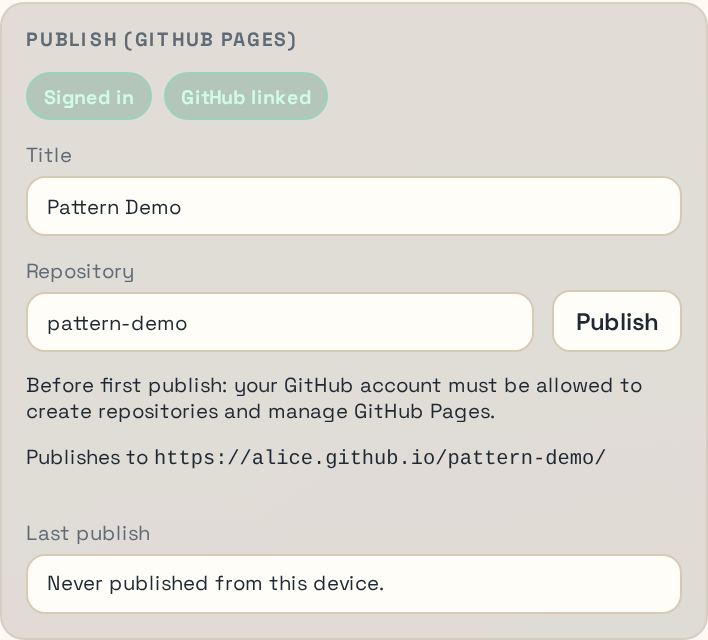

# Publish to GitHub Pages

This walkthrough takes a finished PhaserForge project and publishes it to GitHub Pages from the Cloud pane. It assumes you already completed [Cloud Account Setup](./cloud-account-setup) and already finished [Pattern Demo](./pattern-demo).

## What Publishing Requires

Before you start, make sure:

- you are already signed in to PhaserForge Cloud
- the GitHub account you intend to use is already connected or ready to connect
- your project already has working content

## 1. Open the Cloud Pane for This Project

Open the right-side Cloud pane for the project you just built. Figure 10 shows the publish section you should be working from. If you discover here that you are signed out or GitHub is disconnected, stop and fix that first with [Cloud Account Setup](./cloud-account-setup).

<em>Figure 10. Cloud publish section with title and repository fields.</em>

Success check:
- The Cloud pane shows you as signed in.
- The publish section is available instead of only showing a sign-in or connect-GitHub prompt.

## 2. Fill in the Publish Details

In the publish section, confirm or edit:

- the project title
- the publish repository name

The repository name becomes part of the final URL. Pick a simple slug that you are comfortable exposing publicly.

Practical advice:

- keep the repo name short and lowercase
- avoid spaces and punctuation you do not want in a URL
- if you are publishing the pattern demo, choose a name that clearly identifies it as a demo

Success check:
- The publish button is enabled.
- The target URL preview matches the repository name you want.

## 3. Run the Precheck and Start Publish

Use the publish action in the Cloud pane. PhaserForge runs a precheck so you can see whether the target repository already exists and whether Pages is already configured. Keep Figure 10 in view while you work through this step.

If the tool reports that it will create a repository, that is expected for a first publish. If it reports that it will update an existing repository, read the prompt carefully and confirm only if that repository is the one you intend to reuse.

Success check:
- The precheck completes without a blocking error.
- You understand whether the publish will create or update a repository.

## 4. Confirm the Publish Result

After a successful first publish, the Cloud pane should report that GitHub Pages accepted the deployment and show the resulting target URL.

Success check:
- The Cloud pane reports a successful deployment handoff.
- The target URL shown by PhaserForge matches the GitHub Pages site you expect.

## 5. Verify the Site in the Browser

Open the GitHub Pages URL and confirm:

- the page loads without a GitHub 404
- your game boots
- the expected scene appears
- controls or motion behave the same way they did locally

If the page exists but shows stale content, give GitHub Pages a short time to finish deployment and refresh again.
If you're using Chrome, you may need to do a hard refresh to get the game to update: hold down the CTRL key and click the refresh button to the left of the address bar.

## Common Failure Modes

- `GitHub not linked`
  Use the Cloud pane to connect GitHub first.

- Publish button disabled
  Check that the project has the required metadata and that the repository field is valid.

- GitHub Pages permission error
  Your connected GitHub account may not have granted the permissions PhaserForge needs to manage Pages for that repository.

- Wrong repository targeted
  Stop and correct the repository field before confirming an overwrite or update.

For more detail, see [GitHub Pages Publish Troubleshooting](../troubleshooting/github-pages-publish).
